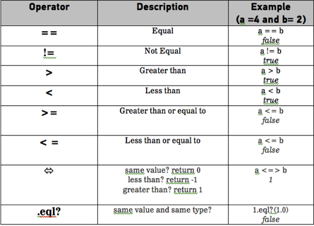
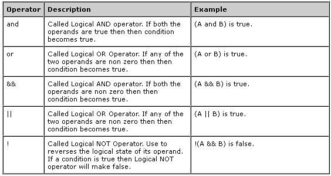

#BEWD - Git & Contiditional Logic

###Bernard Kravitz
#### bernie@gowatchit.com | @bjk

---


##Agenda

*	Quiz
*	Git
* Conditionals and Boolean Logic
* Loops
* Head-splode	
* Lab Time

---

##QUIZ
1.	How do I change directories using the command line?
1. What is a variable ? 
1. How do  you assign a variable? 
1. What is a method?
1. What's an example of good style? 

---

##Git
###What Is Git?

* Git is a source control management tool.
* Git allows you to store and update your code in a structured way.
* Git includes history of changes you make, so you can create "checkpoints" and track your work better over time.
* Git is an intelligent tool, and does many things for you automatically, but can be tricky to use in some cases. It takes a bit of learning to get fully comfortable with Git.

---

##Git
###What is GitHub?

* GitHub is a service that lets you host Git repositories in the cloud.
	* In other words, they are hosted remotely by GitHub, and can be downloaded from / uploaded to over the internet.
* GitHub allows you to easily distribute code to others by sharing your repository.
* GitHub lets you view your code online easily with a web interface.
* GitHub is free to use as long as you make your code public.
	* Private repositories cost a monthly fee.

---

##Git
###Git + GitHub Workflow Diagram


---


##Git Basics

---


##GitHub
###What is a GitHub fork?

* As you work on projects in this class, we want you to use GitHub.
* To gain easy access to all the class files, you will check out the class GitHub repository on your machine.
* In order to ensure that changes you make for your projects do not mix with other students work, you will create a *fork* of the class GitHub repository.
* You will then make changes to your fork, and occasionally pull down changes from the origin class repository.

---

##GitHub
###GitHub Forks Diagram


---


##Git In Class

---


## Git It Together

---

## Strings Review

---


##Teddit - Strings

Teddit is a news aggregator we will build during this course.

---


##More Data Types
###Booleans 

* Besides strings and integers, Ruby also has a Boolean data type
* A boolean is a simple value that is either ```true``` or ```false```
* When different data types are compared to each other, the result of that comparison is a boolean result (e.g. 5 < 7 => true)

---


##Boolean
###Logic Operators





---


##Booleans

---


##Variables & Data Types
###Recap 

Data Types

*	Number
*	Float (number with decimals)
*	String
*	Booleans

Variables

*	Store values
*	Can be passed to methods as parameters

---

##Conditional Logic
###Decision Time 

It's either TRUE or FALSE (like booleans)

If you are greater than 18 
you are an adult

	if age > 18
		puts "You are an adult"
	end

---


##Conditional Logic
###Multiple Conditions


	guess = 7 
	if guess > 5
		puts "Too high!"
	elseif guess < 5
		puts "Too Low!"
	else
		puts "You've guessed my hidden digit!"
	end

---

##Conditional Logic
###Multiple Conditions



---


##Lab Time
* 	Conditional Teddit

---


## Homework
###Secret Number

Let's see a demo of Secret Number

*	HW 1 - Secret Number
	*	Secret number is a game we will incrementally build for homework during the Ruby portion of the course. 
		Players must guess a secret number and your program will provide feedback. 
---

